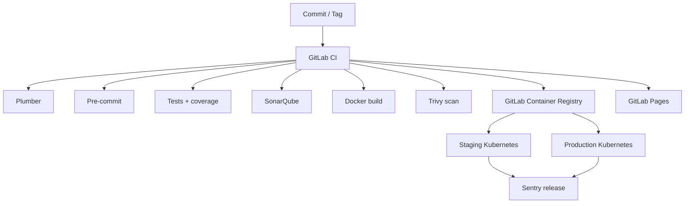

# Architecture

```mermaid
flowchart TD
  Dev[Commit / Tag] --> CI[GitLab CI]
  CI --> Plumber[Plumber]
  CI --> Hooks[Pre-commit]
  CI --> Tests[Tests + coverage]
  CI --> Sonar[SonarQube]
  CI --> Build[Docker build]
  CI --> Trivy[Trivy scan]
  CI --> Registry[GitLab Container Registry]
  Registry --> Staging[Staging Kubernetes]
  Registry --> Prod[Production Kubernetes]
  Staging --> Sentry[Sentry release]
  Prod --> Sentry
  CI --> Pages[GitLab Pages]
```

La pipeline suit une logique simple: validation du code, analyse qualité, construction d'image, scan de sécurité, puis déploiement vers staging et production.
